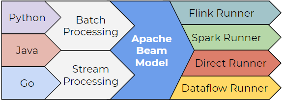

# Apache Beam

## o que é o Apache Beam? 

O Apache Beam é um modelo de programação unificado de código aberto para pipelines de processamento de dados em lote e em streaming que simplifica a dinâmica de processamento de dados em grande escala.

### Vantagens ✅
-  É uma tecnologia versátil que oferece suporte as seguintes linguagens de programação: Java, Python, Go 
-  Conta com uma variedade de executores de pipeline (runners), permitindo que os usuários escolham a melhor opção para suas necessidades de execução.
-  Capacidade de integrar dados de diversas fontes, proporcionando uma flexibilidade maior no desenvolvimento de pipelines de processamento de dados.

## Arquitetura 
### 1. Beam SDK (Software Development Kit)

O SDK do Beam, ou Kit de Desenvolvimento de Software do Beam, é um conjunto de ferramentas e bibliotecas que permite aos desenvolvedores criar pipelines de processamento de dados usando o Apache Beam. Ele fornece APIs para definir fontes de dados, transformações e saídas, além de oferecer suporte para execução em diferentes runners (executores) de pipeline.

### 2. Pipeline Construction 

Refere-se ao processo de criação de pipelines de processamento de dados usando o Apache Beam. Isso envolve a definição de fontes de dados, a aplicação de transformações para processar esses dados e a configuração de saídas para os resultados finais.

### 3. Ferramentas de execução

 São os componentes responsáveis por executar os pipelines de processamento de dados definidos com o Apache Beam. Existem diferentes ferramentas de execução disponíveis, como o Direct Runner (para execução local), o Apache Flink, o Apache Spark, o Google Cloud Dataflow, entre outros.

### 4. Fn Runners

 São executores específicos para funções (ou "Fn", abreviação de "função") no Apache Beam. Eles são responsáveis por executar transformações personalizadas ou funções definidas pelo usuário dentro dos pipelines. Os Fn Runners são usados para execução distribuída de funções em paralelo dentro do ambiente de execução do Apache Beam.

## Conceitos
### 1. Pipeline
### 2. PCollection
### 3. PTransform
